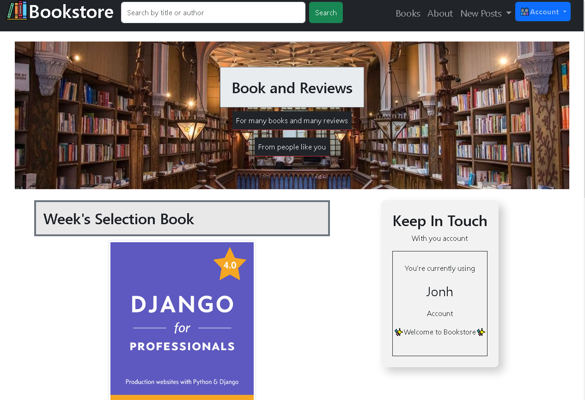

# Django Bookstore

This project is a server site rendering (SSR) with django and many third party packages to complete fully understand django and building a complete project with django. This project is a version of the project offered in the book **Django for Professionals Production websites with Python  Django 4.0 (William Vincent)** and is live coded with modifications by me Rvjonh or just Jonh😎.



The project has:

* UI in many templates
    1. Home Page
    2. About Page
    3. Search Filter Dor Books
    4. Books By User (Publisher)
    5. Full User Authentication Pages
* Many routes rendered in backend
* Models a CustomUsers, Book and their Reviews
* User Account management
* CRUD operations in models after metioned
* Pagination in Books Sections and Reviews Sections
* Mention Third Party Libraries:
    1. [django-crispy-forms](https://django-crispy-forms.readthedocs.io/en/latest/)
    2. [django-allauth](https://django-crispy-forms.readthedocs.io/en/latest/)
    3. For branch render-deploy-with-googledrive
        1. [Django Google Drive Storage](https://django-googledrive-storage.readthedocs.io/en/latest/)

## Local Development

Follow every command below to put it running in your machine

1. Setting Repository in your machine

    ```CMD
    git clone https://github.com/Rvjonh/django_bookstore.git     # clone the repository in the actual dir
    py -m venv .venv    # creates a python environment
    .venv\Scripts\activate.bat  # activate the environment (Windows)
    pip install -r requirements.txt     # install dependencies for the project (ej. django)
    ```

2. Configure your local variables (Windows)

    ```.ENV
    copy .env-copy .env     # Make a copy of the file
    You need to fill all the variables ... to put it work full correctly
    ```

3. Configure your database system

    In this section you will have to create a mysql database and add it to in the file django_project/settings, and modify the DATABASES section, if you have MySQL in your computer will easy, just follow these steps: [How to connect MySQL to Django](https://www.javatpoint.com/how-to-connect-mysql-to-django)

    or just change the DATABASE confi to:

    ```CMD
    DATABASES = {
        "default": {
            "ENGINE": "django.db.backends.sqlite3",
            "NAME": BASE_DIR / "db.sqlite3",
        }
    }
    ```

4. Start the development server

    ```CMD
    py manage.py makemigrations
    py manage.py migrate
    py manage.py runserver
    ```

5. Visit your server website url for development (Example)

    ```CMD
    Watching for file changes with StatReloader
    Performing system checks...

    System check identified no issues (0 silenced).
    December 25, 0000 - 07:00:00
    Django version 4.1.5, using settings 'django_project.settings'
    Starting development server at http://127.0.0.1:8000/
    Quit the server with CTRL-BREAK.
    ```

## Generate Secrect Key

> To create a new Secreat Key for django.settings

```Python
python -c "import secrets; print(secrets.token_urlsafe())"
```
